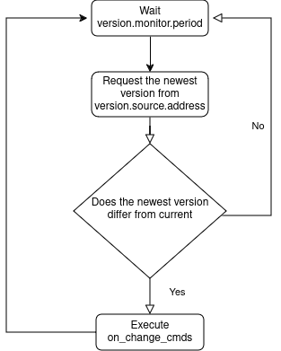

# versiond
Version monitoring demon

# Usage

Clone repo:
```bash
$ git clone https://github.com/ilya-mezentsev/versiond.git
$ cd versiond
```

Compile demon:
```bash
$ make build
```

Move compiled binary to desired location:
```bash
$ mv built/main /opt/versiond/main
```

Run with your config:
```bash
CONFIG-_PATH=/etc/versiond/config.json /opt/versiond/main
```

Read about config format in [corresponding readme](./app/configs/README.md).

# Work scheme



# Stopping demon
Demon supports graceful shutdown; send signal like this:
```bash
$ kill -2 PID
```

Note. Demon writes its own PID to file `<config.cache.dir>/pid`.

# Development
For local testing and development read [dev.md](./docs/dev.md)
